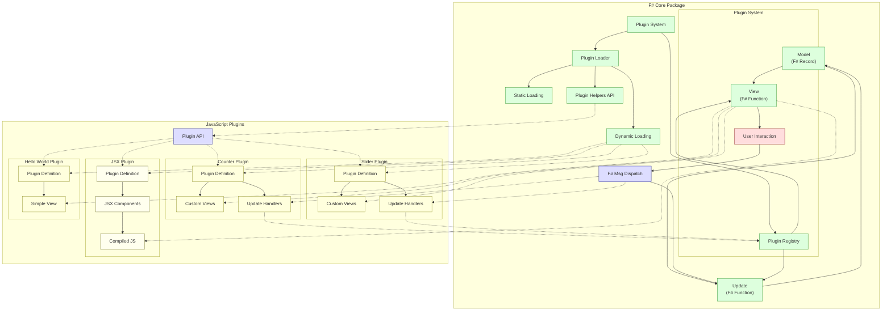

# F# + Fable + Feliz + Elmish プラグインアーキテクチャ

## プロジェクト概要

このプロジェクトは、F#のFable+Feliz+Elmishを使用してMVU（Model-View-Update）アーキテクチャに基づいたコアパッケージを開発し、JavaScriptによるカスタマイズを可能にするプラグインシステムを実現するためのサンプルです。

コアパッケージはF#で開発され、顧客ごとのカスタマイズはJavaScriptによるプラグインとして実装されます。このアプローチにより、F#開発者が少ない環境でも、JavaScript開発者が効率的にカスタマイズを行うことができます。

## アーキテクチャの特徴

- **MVUアーキテクチャの一貫性**: F#側のコアパッケージが厳密にMVUパターンに従い、データの流れを一方向に保つ
- **プラグインシステム**: カスタマイズをプラグイン形式で分離し、コアパッケージの安定性を確保
- **動的ローディング**: 設定ファイルに基づいてプラグインを動的に読み込む機能
- **タイプセーフ**: F#の型システムを活かした安全な設計
- **シンプルなプラグインAPI**: グローバルオブジェクトを隠蔽し、宣言的なインターフェースを提供するヘルパーライブラリ

## ファイル構成

### F#側コードファイル

- **Types.fs**: モデルとメッセージの定義
- **PluginSystem.fs**: プラグイン管理システム
- **PluginLoader.fs**: プラグイン動的読み込み機能
- **Interop.fs**: JavaScript連携機能
- **Subscription.fs**: サブスクリプション管理
- **Update.fs**: 状態更新関数
- **View.fs**: UIレンダリング関数
- **App.fs**: アプリケーションエントリーポイント

### JavaScript側コードファイル

- **plugin-helpers.js**: シンプルなプラグイン開発API（`plugin`関数）
- **counter-extension.js**: カウンターページ拡張プラグイン
- **slider-tab.js**: スライダータブプラグイン
- **hello-world-plugin.js**: シンプルなHello Worldプラグイン
- **jsx-plugin-example.js**: JSXを使用したプラグイン例
- **plugins.json**: プラグイン設定ファイル

## コア機能

- **ホームタブ**: シンプルなメッセージ表示ページ
- **カウンタータブ**: インクリメント・デクリメントボタンを持つカウンター
- **カスタムプラグイン**: 
  - カウンター拡張（2倍にするボタン追加）
  - スライダータブ（0-100の範囲で値を調整できるスライダー）
  - Hello Worldタブ（シンプルな例）
  - JSXプラグイン例（ビルドプロセスを説明）

## プラグインシステムの主要コンポーネント

### F#側

#### プラグイン定義

```fsharp
// プラグイン定義タイプ
type PluginDefinition = {
    Id: string
    Name: string
    Version: string
    Dependencies: string list
    Compatibility: string
}

// 登録済みプラグイン情報
type RegisteredPlugin = {
    Definition: PluginDefinition
    Views: Map<string, obj -> Feliz.ReactElement>
    UpdateHandlers: Map<string, obj -> obj -> obj>
    CommandHandlers: Map<string, obj -> unit>
    Tabs: string list
}
```

#### プラグインローダー

```fsharp
// プラグイン設定を外部JSONから読み込む
[<Emit("fetch($0).then(r => r.json())")>]
let fetchJson (url: string) : JS.Promise<obj> = jsNative

// 動的スクリプト読み込み
[<Emit("new Promise((resolve, reject) => { const script = document.createElement('script'); script.src = $0; script.onload = () => resolve(); script.onerror = () => reject(new Error('Failed to load script: ' + $0)); document.head.appendChild(script); })")>]
let loadScript (url: string) : JS.Promise<unit> = jsNative
```

#### サブスクリプション

```fsharp
// Elmish v4スタイルのサブスクリプション
let subscribe (model: Model) =
    [
        // プラグインローダーサブスクリプション
        [ "pluginLoader" ], pluginLoader
    ]
```

### JavaScript側

#### シンプルなプラグインAPI

```javascript
// 新しい宣言的なプラグイン定義
plugin("plugin-id", {
  name: "Plugin Name",
  version: "1.0.0",
  tab: "custom-tab", // オプション: タブを追加する場合
  
  // ビュー定義
  view: function(model) {
    // Reactコンポーネントを定義
    const MyComponent = function() {
      // Reactフックを使用（コンポーネント内のみで可能）
      const [count, setCount] = React.useState(0);
      
      return React.createElement('div', {}, [
        React.createElement('h1', {}, 'My Plugin'),
        React.createElement('button', {
          onClick: () => dispatch("MyCustomMessage", { value: 42 })
        }, 'Send Message')
      ]);
    };
    
    // コンポーネントをレンダリング
    return React.createElement(MyComponent);
  },
  
  // 更新ハンドラー（メッセージ名がキー）
  MyCustomMessage: function(payload, model) {
    // 更新されたモデルを返す
    return {
      ...model,
      Counter: payload.value,
      CustomState: {
        ...model.CustomState,
        lastUpdated: new Date().toISOString()
      }
    };
  }
});
```

## 統合の流れ

1. F#アプリケーションが起動
2. プラグインローダーがプラグインヘルパーライブラリを読み込む
3. プラグインローダーが静的および動的プラグインを読み込む
4. プラグインがF#側に登録される
5. ユーザーがUIで操作を行うと：
   - F#側のメッセージディスパッチが呼び出される
   - カスタムメッセージの場合、プラグインの更新関数が呼び出される
   - 更新されたモデルでビューが再レンダリングされる

## プラグイン開発ガイド（JavaScript開発者向け）

### 開発方法の進化

#### 1. 初期のアプローチ（グローバルオブジェクトを直接操作）

```javascript
(function() {
    // グローバルオブジェクトに直接追加
    window.customViews = window.customViews || {};
    window.customViews["my-view"] = function(model) {
        // ...
    };
    
    window.customUpdates = window.customUpdates || {};
    window.customUpdates["my-message"] = function(payload, model) {
        // ...
    };
    
    window.customTabs = window.customTabs || [];
    window.customTabs.push("my-tab");
})();
```

#### 2. ビルダーパターンアプローチ（AppPlugins APIを使用）

```javascript
// プラグインビルダーを作成
const builder = AppPlugins.createBuilder(
    "my-plugin",
    "My Plugin",
    "1.0.0"
);

// ビルダーにコンポーネントと更新ハンドラーを追加
builder
    .addView("my-view", renderMyView)
    .addUpdateHandler("my-message", handleMyMessage)
    .addTab("my-tab")
    .register();
```

#### 3. 最新の宣言的アプローチ（シンプルなプラグインAPI）

```javascript
// シンプルな宣言的スタイルでプラグインを定義
plugin("my-plugin", {
  name: "My Plugin",
  version: "1.0.0",
  tab: "my-tab",
  
  // ビュー定義
  view: function(model) {
    const MyComponent = function() {
      // Reactフックを使用
      const [state, setState] = React.useState(0);
      
      return React.createElement('div', {}, [
        // ビューの内容
      ]);
    };
    
    return React.createElement(MyComponent);
  },
  
  // メッセージハンドラー
  MyMessage: function(payload, model) {
    // 更新されたモデルを返す
    return updatedModel;
  }
});
```

### JSXを使ったプラグイン開発

JSXを使用するには、ビルドプロセスが必要です。以下は、JSXでプラグインを開発する例です（ビルド前のコード）：

```jsx
// jsx-plugin-example.js (ビルド前)
plugin("jsx-example", {
  name: "JSX Example Plugin",
  version: "1.0.0",
  tab: "jsx-demo",
  
  view: function(model) {
    // Reactコンポーネントを定義
    const JsxDemoComponent = function() {
      // Reactフックを使用
      const [localCounter, setLocalCounter] = React.useState(0);
      
      return (
        <div className="p-5">
          <h1 className="text-2xl font-bold mb-4">JSX Plugin Example</h1>
          <p>F# Counter: {model.Counter}</p>
          <p>Local Counter: {localCounter}</p>
          <button 
            className="px-4 py-2 bg-blue-500 text-white rounded"
            onClick={() => setLocalCounter(localCounter + 1)}>
            Local +1
          </button>
        </div>
      );
    };
    
    // コンポーネントをレンダリング
    return React.createElement(JsxDemoComponent);
  }
});
```

### React Hooksを使う際の注意点

Reactフックを使用する場合は、必ずReactコンポーネント内で使用してください：

```javascript
// 正しい例
view: function(model) {
  // Reactコンポーネントを定義
  const MyComponent = function() {
    // ここでフックを使用できます
    const [state, setState] = React.useState(0);
    return React.createElement('div', {}, state);
  };
  
  // コンポーネントをレンダリング
  return React.createElement(MyComponent);
}

// 間違った例：直接viewの中でフックを使用
view: function(model) {
  // ここでフックを使用するとエラーになります
  const [state, setState] = React.useState(0);
  return React.createElement('div', {}, state);
}
```

### 状態管理のルール

1. **永続的な状態はF#側のモデルで管理**:
   - 重要なアプリケーション状態はF#モデルに保存
   - JavaScript側は`model.CustomState`マップを通じて永続データを保存

2. **一時的なUI状態はReactのフックで管理**:
   - フォームの入力値やUIの一時的な状態は`useState`で管理
   - コンポーネントのマウント/アンマウント処理は`useEffect`で管理

3. **一方向データフロー**:
   - モデルの更新は必ずdispatchを通じて行う
   - 直接モデルを変更しない

### メッセージングのパターン

```javascript
// F#側にメッセージを送信
dispatch("MessageType", { key: "value" });

// 更新関数の例
MyMessage: function(payload, model) {
  console.log("Received payload:", payload);
  return {
    ...model,
    CustomState: {
      ...model.CustomState,
      myValue: payload.key
    }
  };
}
```

## デバッグのヒント

- F#側のモデル更新がJavaScript側に反映されない場合、更新関数の戻り値を確認
- JavaScriptからのメッセージがF#側に届かない場合、配列形式 `["type", payload]` になっているか確認
- プラグインが読み込まれない場合、コンソールでエラーメッセージを確認
- Reactフックを使用する場合は、必ずReactコンポーネント内で使用する
- ブラウザの開発者ツールでネットワークタブを確認し、すべてのスクリプトが正しく読み込まれているか確認

## F#+Fable+Feliz+Elmishプラグインアーキテクチャ図


## 主な改良点

- プラグイン特有のロジックをUpdate.fsから削除し、プラグインシステムを通じて処理するように変更
- プラグインがタブを追加した際の再描画メカニズムを追加
- 宣言的なプラグイン開発APIを導入（`plugin`関数）
- F#-JavaScript間の互換性処理をフレームワーク側に隠蔽
- React Hooksを正しく使用するためのパターンを導入
- JSXサポートを追加
- シンプルなHello Worldプラグインの例を追加

## 補足
- ./docにある文書も読むこと