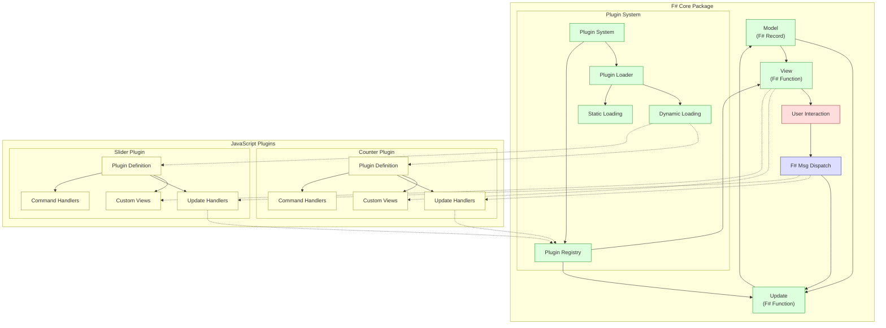

# F# + Fable + Feliz + Elmish プラグインアーキテクチャ

## プロジェクト概要

このプロジェクトは、F#のFable+Feliz+Elmishを使用してMVU（Model-View-Update）アーキテクチャに基づいたコアパッケージを開発し、JavaScriptによるカスタマイズを可能にするプラグインシステムを実現するためのサンプルです。

コアパッケージはF#で開発され、顧客ごとのカスタマイズはJavaScriptによるプラグインとして実装されます。このアプローチにより、F#開発者が少ない環境でも、JavaScript開発者が効率的にカスタマイズを行うことができます。

## アーキテクチャの特徴

- **MVUアーキテクチャの一貫性**: F#側のコアパッケージが厳密にMVUパターンに従い、データの流れを一方向に保つ
- **プラグインシステム**: カスタマイズをプラグイン形式で分離し、コアパッケージの安定性を確保
- **動的ローディング**: 設定ファイルに基づいてプラグインを動的に読み込む機能
- **タイプセーフ**: F#の型システムを活かした安全な設計

## ファイル構成

### F#側コードファイル

- **Types.fs**: モデルとメッセージの定義
- **PluginSystem.fs**: プラグイン管理システム
- **PluginLoader.fs**: プラグイン動的読み込み機能
- **Subscription.fs**: サブスクリプション管理
- **Update.fs**: 状態更新関数
- **View.fs**: UIレンダリング関数
- **App.fs**: アプリケーションエントリーポイント

### JavaScript側コードファイル

- **counter-extension.js**: カウンターページ拡張プラグイン
- **slider-tab.js**: スライダータブプラグイン
- **plugins.json**: プラグイン設定ファイル

## コア機能

- **ホームタブ**: シンプルなメッセージ表示ページ
- **カウンタータブ**: インクリメント・デクリメントボタンを持つカウンター
- **カスタムプラグイン**: 
  - カウンター拡張（2倍にするボタン追加）
  - スライダータブ（0-100の範囲で値を調整できるスライダー）

## プラグインシステムの主要コンポーネント

### F#側

#### プラグイン定義

```fsharp
// プラグイン定義タイプ
type PluginDefinition = {
    Id: string
    Name: string
    Version: string
    Dependencies: string list
    Compatibility: string
}

// 登録済みプラグイン情報
type RegisteredPlugin = {
    Definition: PluginDefinition
    Views: Map<string, obj -> Feliz.ReactElement>
    UpdateHandlers: Map<string, obj -> obj -> obj>
    CommandHandlers: Map<string, obj -> unit>
    Tabs: string list
}
```

#### プラグインローダー

```fsharp
// プラグイン設定を外部JSONから読み込む
[<Emit("fetch($0).then(r => r.json())")>]
let fetchJson (url: string) : JS.Promise<obj> = jsNative

// 動的スクリプト読み込み
[<Emit("new Promise((resolve, reject) => { const script = document.createElement('script'); script.src = $0; script.onload = () => resolve(); script.onerror = () => reject(new Error('Failed to load script: ' + $0)); document.head.appendChild(script); })")>]
let loadScript (url: string) : JS.Promise<unit> = jsNative
```

#### サブスクリプション

```fsharp
// Elmish v4スタイルのサブスクリプション
let subscribe (model: Model) =
    [
        // プラグインローダーサブスクリプション
        [ "pluginLoader" ], pluginLoader
    ]
```

### JavaScript側

#### プラグインの構造

```javascript
(function() {
    // プラグイン定義
    const pluginDefinition = {
        id: "plugin-id",
        name: "Plugin Name",
        version: "1.0.0",
        dependencies: [],
        compatibility: "1.0"
    };
    
    // カスタムビュー定義
    const views = {
        "view-id": function(model) {
            // Reactコンポーネントを返す
            return React.createElement(...);
        }
    };
    
    // カスタム更新関数
    const updateHandlers = {
        "message-type": function(payload, model) {
            // 更新されたモデルを返す
            return { ...model, someProperty: newValue };
        }
    };
    
    // コマンドハンドラー
    const commandHandlers = {
        "command-type": function(payload) {
            // サイドエフェクトを実行
        }
    };
    
    // タブ定義
    const tabs = ["tab-id"];
    
    // プラグイン初期化関数
    function initPlugin() {
        console.log("Plugin initialized");
    }
    
    // プラグイン登録
    if (window.registerFSharpPlugin) {
        window.registerFSharpPlugin({
            definition: pluginDefinition,
            views: views,
            updateHandlers: updateHandlers,
            commandHandlers: commandHandlers,
            tabs: tabs,
            init: initPlugin
        });
    }
})();
```

## 統合の流れ

1. F#アプリケーションが起動
2. プラグインローダーが静的および動的プラグインを読み込む
3. プラグインがF#側に登録される
4. ユーザーがUIで操作を行うと：
   - F#側のメッセージディスパッチが呼び出される
   - カスタムメッセージの場合、プラグインの更新関数が呼び出される
   - 更新されたモデルでビューが再レンダリングされる

## JavaScript開発者向けガイドライン

### 状態管理のルール

1. **永続的な状態はF#側のモデルで管理**:
   - 重要なアプリケーション状態はF#モデルに保存
   - JavaScript側は`model.CustomState`マップを通じて永続データを保存

2. **一時的なUI状態はReactのフックで管理**:
   - フォームの入力値やUIの一時的な状態は`useState`で管理
   - コンポーネントのマウント/アンマウント処理は`useEffect`で管理

3. **一方向データフロー**:
   - モデルの更新は必ずdispatchを通じて行う
   - 直接モデルを変更しない

### メッセージングのパターン

```javascript
// F#側にメッセージを送信
window.appDispatch(["MessageType", { key: "value" }]);

// 更新関数
function updateHandler(payload, model) {
    console.log("Received payload:", payload);
    return {
        ...model,
        CustomState: {
            ...model.CustomState,
            myValue: payload.key
        }
    };
}
```

## デバッグのヒント

- F#側のモデル更新がJavaScript側に反映されない場合、更新関数の戻り値を確認
- JavaScriptからのメッセージがF#側に届かない場合、配列形式 `["type", payload]` になっているか確認
- プラグインが読み込まれない場合、コンソールでエラーメッセージを確認

## Elmish v4に関する注意点

- サブスクリプションは `[ "name" ], handler` の形式のリストとして定義
- `Cmd.ofSub`は廃止され、代わりに適切な関数を使用（`Cmd.OfFunc.perform`など）

## F#+Fable+Feliz+Elmishプラグインアーキテクチャ図
